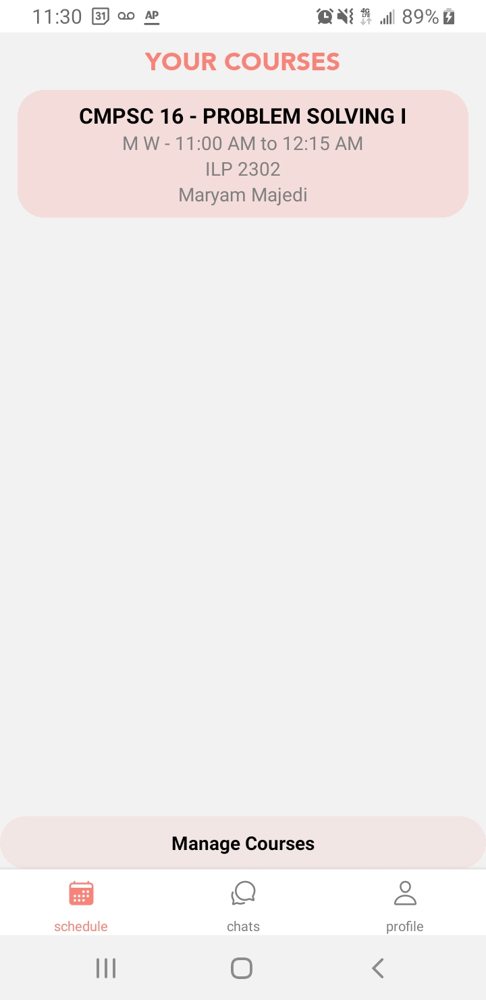
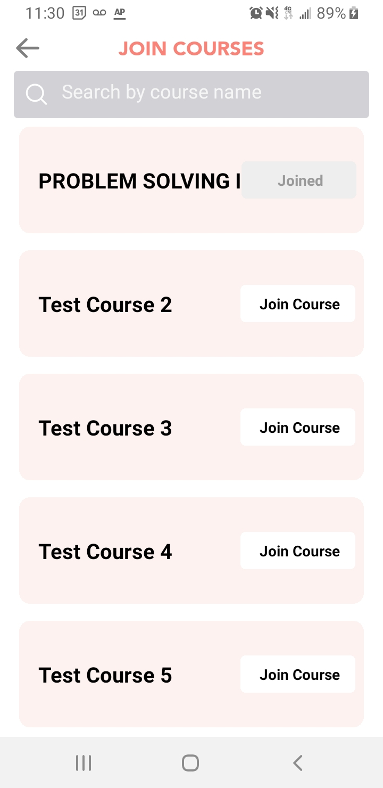

# HW 4
All changes I made for HW4 are noted in this PR: [#81](https://github.com/ucsb-cs184-f23/pj-react-04/pull/81)

### Further Details
My main results from this assignment are backend functionality for user courses and some UI components for joining courses: 
- Firestore operations to manipulate courses in our database: [useCourseData.ts](https://github.com/ucsb-cs184-f23/pj-react-04/pull/81/files#diff-db0cb14558580ccc98cf929254cb4533fbf0bb4109d568e778a0961b6a946d66)
- Various additional actions for the app's redux store: [reducer.ts](https://github.com/ucsb-cs184-f23/pj-react-04/pull/81/files#diff-69bb7347c64e035143d5af8318eb3344484dad75b79918d25538f288544df2b2)
- Modifications to the schedule screen to use this new backend: [ScheduleScreen.tsx](https://github.com/ucsb-cs184-f23/pj-react-04/pull/81/files#diff-dcd8f43c6cddf542b5df640bc8abf12aef465735d1ef6ec820747f302f1a1535)
    - Schedule screen (no visible changes made): 
- A new JoinCourses screen which is connected to my new backend: [JoinCoursesScreen.tsx](https://github.com/ucsb-cs184-f23/pj-react-04/pull/81/files#diff-3099c06c82c9b3ec3adb14049631cc92035f2b923f88f19bbc13206be035549d)
    - New UI screenshot: 