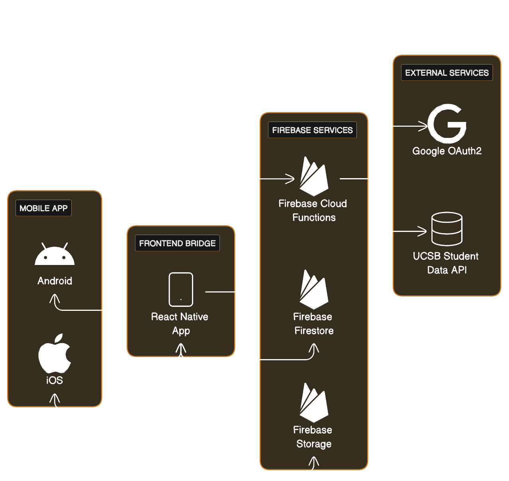

# Project Documentation

## Overview System Architecture

## Description
- The frontend client is composed of a React Native App optimized for both Android and IOS. 
- The backend consists of Firebase cloud functions, database, and storage
- The client authenticates with and uses the UCSB Student Data API through cloud functions
- The client directly reads and updates data in the Firestore Database and Storage.

**CS148 Changes:**
- In this area, we have been adding new features within the framework, so the stack and system design has not changed significantly
- We have been using a direct get from the mobile devices to the UCSB API for dining services but are currently moving that utility to the firebase server. This is in keeping with the diagram above. The Firebase server will update the menus once a day and store them. The mobile devices will get() from our server.
- We will have migrated the events api call to firebase as well by the end of the quarter.

## Team Decisions

* **Summary:**
  This project is a living organism. We set out with the very loosely defined goal of creating an app that could be an all around utility for UCSB students, but the specifics did not take shape immediately. Here are a few of what we consider to be the most pivotal decisions our group has made over the course of this project.

  * Decision 1: [Link to Meeting Notes](../team/sprint02/2_10-14-7pm.md)
    - We decided to build the app around a core feature of groupchats that correspond to courses.

  * Decision 2: [Link to Meeting Notes](../team/sprint03/3_lec10-23.md)
    - We decided to add Redux state management throughout the project.

  * Decision 3: [Link to Meeting Notes](../team/sprint05/3_lec11-08.md)
    - We decided to use a node server with Firebase Cloud Functions to better handle AUTH and API calls.

  <!-- Add more decisions as needed -->

## User Experience (UX) Considerations

* **High-Level Task/User Flow:**

  1. **Step 1:**
     Hit the welcome screen and authenticate with Google OAUTH2 through DUO Authentication

  2. **Step 2:**
     Arrive at home screen and peruse a list of currently enrolled classes

  3. **Step 3:**
     Press a class on the home screen to join a groupchat for that class or export the schedule to google calendar

  4. **Step 4:**
     Visit the chats page to view and open groupchats

  5. **Step 5:**
     Visit the profile page change public-facing information about your profile

  <!-- Add more steps as needed -->

## Next Steps

**Upcoming Features:**
- Export course schedule data to calendar
- Improve auth flow and add API integration
- View course locations in google maps

## Additional Resources

* [GitHub Repository](https://github.com/ucsb-cs184-f23/pj-react-04/)
* [User Manual](MANUAL.md)
* [Meeting Notes Archive](/team/)
