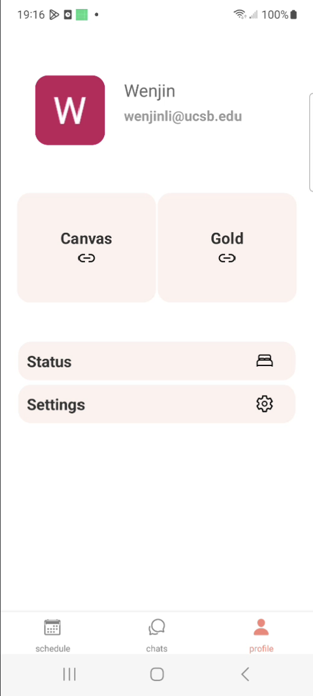

# UCSB Coral User Manual

## Table of Contents

- [1. Introduction](#1-introduction)
- [2. Purpose](#2-purpose)
- [3. Intended User Audience](#3-intended-user-audience)
- [4. Features](#4-features)
- [5. Getting Started](#5-getting-started)
  - [5.1 Installation](#51-installation)
  - [5.2 Login](#52-login)
- [6. How to Join Group Chats](#6-how-to-join-group-chats)
  - [6.1 Finding Classes](#61-finding-classes)
  - [6.2 Joining a Group Chat](#62-joining-a-group-chat)
- [7. Screenshots](#7-screenshots)
  - [7.1 Screen 1](#71-login-screen)
  - [7.2 Screen 2](#72-class-selection)
  - [7.3 Screen 3](#73-group-chat-interface)
- [8. Troubleshooting](#8-troubleshooting)
  - [8.1 Unable to Join a Chat](#81-unable-to-join-a-chat)
  - [8.2 Technical Issues](#82-technical-issues)
- [9. Frequently Asked Questions (FAQ)](#9-frequently-asked-questions-faq)
- [10. Contact and Support](#10-contact-and-support)

## 1. Introduction

Welcome to the official user manual for Coral! This document provides comprehensive information on how to use the app effectively

## 2. Purpose

Coral is a Cross-Platform React Native application designed to help UCSB students reduce friction in their day to day academic workflows. From managing class schedules and meetings to facilitating easy communication and collaboration among UCSB students, we hope Coral will be a companion app to many aspects of academic life.

## 3. Intended User Audience

This app is intended for students currently attending UCSB

## 4. Features

- View a list of courses in which you are currently enrolled
- Join a unique groupchat for each course
- export class schedules and locations to google calender
- ...more to come

## 5. Getting Started

### 5.1 Installation

Install directly from the [IOS App Store](https://google.com) or [Android Play Store](https://google.com)

### 5.2 Login

Authenticate using UCSB organizational email (@ucsb.edu).

## 6. How to Join Group Chats

### 6.1 Finding Classes

Once you are enrolled in a class on Gold, it should show up in your schedule page within a few minutes. If you need to interact with a class in which you are not enrolled, you can search for courses from the Manage Couses screen.

### 6.2 Joining a Group Chat

From the schedule page, press a course to open an info modal. Then click "join chat". After a chat has been joined, it is accessible directly from the chats page.

## 7. Screenshots

### 7.1 Screen 1

### 7.2 Screen 2

### 7.3 Screen 3

## 8. Troubleshooting

### 8.1 Unable to Join a Chat

Lorem ipsum dolor sit amet, consectetur adipiscing elit. ...

### 8.2 Technical Issues

Lorem ipsum dolor sit amet, consectetur adipiscing elit. ...

## 9. Frequently Asked Questions (FAQ)

- **Q: Do I need to be a current UCSB Student?**

  - A: Yes, for the app to work effectively, you should be actively enrolled in classes.

- **Q: Can I use the app on multiple devices?**
  - A: Currently, do not have e release for web or desktop, the app will work simultainiously on multiple devices.

## 10. Contact and Support

For further assistance, please contact our support team at [support@example.com](mailto:support@example.com).
