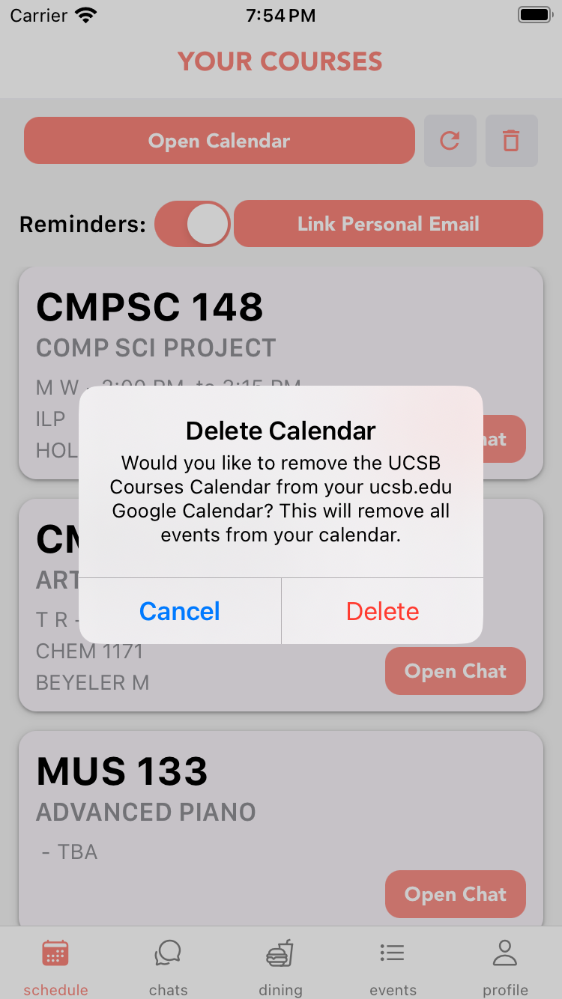

# UCSB Coral User Manual

## Table of Contents

- [1. Introduction](#1-introduction)
- [2. Purpose](#2-purpose)
- [3. Intended User Audience](#3-intended-user-audience)
- [4. Features](#4-features)
- [5. Getting Started](#5-getting-started)
  - [5.1 Installation](#51-installation)
  - [5.2 Login](#52-login)
- [6. How to](#6-how-to)
  - [6.1 Finding Classes](#61-finding-classes)
  - [6.2 Joining a Group Chat](#62-joining-a-group-chat)
- [7. Screenshots](#7-screenshots)
- [8. Troubleshooting](#8-troubleshooting)
  - [8.1 Unable to Join a Chat](#81-unable-to-join-a-chat)
  - [8.2 Technical Issues](#82-technical-issues)
- [9. Frequently Asked Questions (FAQ)](#9-frequently-asked-questions-faq)
- [10. Contact and Support](#10-contact-and-support)

## 1. Introduction

Welcome to the official user manual for Coral! This document provides comprehensive information on how to use the app effectively

## 2. Purpose

Coral is a Cross-Platform React Native application designed to help UCSB students reduce friction in their day to day academic workflows. From managing class schedules and meetings to facilitating easy communication and collaboration among UCSB students, we hope Coral will be a companion app to many aspects of academic life.

CS 148 update:

Now featuring seamless integration with campus events, enhanced Google Calendar syncing, and dining menus with personalized preferences, Coral streamlines the essential aspects of your UCSB experience.

## 3. Intended User Audience

This app is intended for students currently attending UCSB

## 4. Features

- View a list of courses in which you are currently enrolled
- Join a unique groupchat for each course
- export class schedules and locations to google calendar

CS148 Update:

- Stay up-to-date with campus events and activities, with integration to Google Calendar
- Synchronize your Coral schedule with your Google Calendar for a unified view
- Browse dining menus with your personalized preferences stored for quick meal decisions
- ... with more to come!

## 5. Getting Started

### 5.1 Installation

Install directly from the [IOS App Store](https://google.com) or [Android Play Store](https://google.com)

### 5.2 Login

Authenticate using UCSB organizational email (@ucsb.edu).

## 6. How to

### 6.1 Finding Classes

Once you are enrolled in a class on Gold, it should show up in your schedule page within a few minutes. If you need to interact with a class in which you are not enrolled, you can search for courses from the Manage Couses screen.

### 6.2 Joining a Group Chat

From the schedule page, press a course to open an info modal. Then click "join chat". After a chat has been joined, it is accessible directly from the chats page.

## CS148 Updates

### 6.3 Syncing Classes and Getting Reminders

Keep your schedule perfectly in sync!  From your Coral schedule view, easily link your classes to Google Calendar.  Choose to link to a personal email for even greater flexibility. Need to update your schedule? Options to resync or delete are available as your schedule changes.  Best of all, set a reminder for 40 minutes before your class so you're always on time.

### 6.4 Staying Connected to Campus Life

Never miss out on exciting events! Browse the events tab for the latest campus happenings.  Found something that interests you? Add it directly to your Google Calendar with a single click.

### 6.5 Personalizing Your Dining Experience

Discover your favorite meals and make dining choices a breeze! Browse dining menus and mark your preferences. The next time your top picks are on the menu, they'll be highlighted for a quick and easy decision.

## 7. Screenshots

All of these are completely updated for CS148.

### Welcome

### Schedule

### Chat

### Dining

### Events

### Profile

## 8. Troubleshooting

### 8.1 Unable to Join a Chat

Please ensure that you are enrolled in the course.

### 8.2 Technical Issues

Contact us! Email <as-osa-publicinterest@ucsb.edu> and we would love to help.

## 9. Frequently Asked Questions (FAQ)

- **Q: Do I need to be a current UCSB Student?**

  - A: Yes, for the app to work effectively, you should be actively enrolled in classes.

- **Q: Can I use the app on multiple devices?**
  - A: Currently, we do not have a release for web or desktop. However, the app will work simultainiously on multiple devices.

## 10. Contact and Support

For further assistance, please contact our support team at <as-osa-publicinterest@ucsb.edu>.
